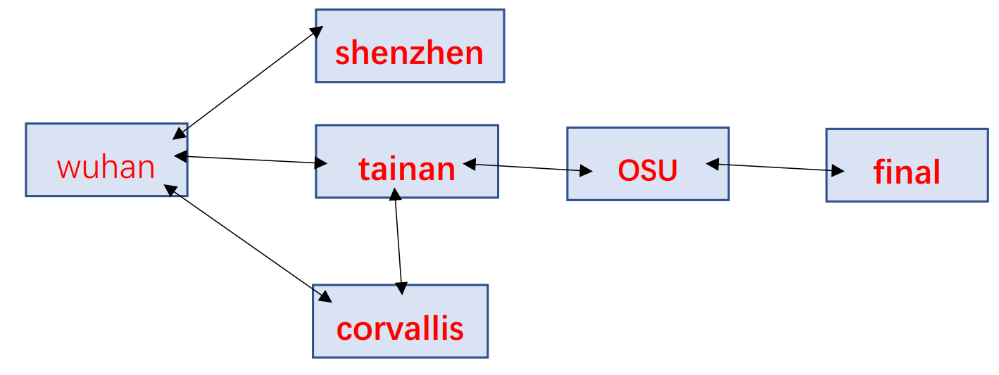

<!-- row -->

# Project Description
&ensp;&ensp;Our project is an RPG adventure game including character, monster, and several rooms. In the game, there would be some monsters in some rooms. When the player gets into the room which has monster inside, the player is engaged. When fighting with a monster, the rule is all about strength and health. If the character’s strength is larger than the monster’s, then the character can easily win and good to do other actions and move to the next room; however, if the monster’s strength is greater than the character’s, then it will be challenging to fight with the monster.  
&ensp;&ensp;To win this game, there is final room with two monsters inside. If you can defeat two of them, you win this game.

# How to Run Our Code?
&ensp;&ensp;We choose C++ to achieve modularity. There are four ‘.h’ files and five ‘.cpp’ files. When compiling, we provide two ways for different operating systems to execute our program. But first, you need a C++ environment.

<!-- row 6 -->

## Windows
&ensp;&ensp;For Windows users, you can either execute `adventure.sln` in Visual Studio to run the program or just clicking the `adventure.exe` file and you can enjoy the game.

<!-- col 6 -->

## Linux / MacOS
&ensp;&ensp;For Linux / MacOS users, you can simply type `make` in the terminal and execute the program by entering `./adventure`, then you can enjoy the game.

<!-- row -->

---
&ensp;&ensp;When running the program, the character will start at the initial room and start adventuring.
When get to a room, there might be some items in it, which might include weapons or an apple to use. This game is simple. You can fight with the monster if encountering or moving to the room. If you feel tired, you can just quit the game.

There are several commands provided for players to use:
## Engaged:
#### Fight
&ensp;&ensp;When meeting a monster, the player can enter <kbd>F / f</kbd> to engage. When fighting with the monster, if the character's strength is greater than the monster's, each hit will cause the 50 times of the strength difference from character's and the monster's. If the character's strength is equal or smaller than the monster's, then the character can only cause 50 damage to the monster per round. The monster can only steadily cause 75 damage to the character per round in any conditions. The fight ends if one of each is dead. If the monster died, then the character won and restore its health (hp) by up to 80%. If your health is over 80% after the fight, you won't be restored. If you lose the fight, you lose the game.
## Not Engaged:
#### State
&ensp;&ensp;The player can check the player's status and the room's status. For the player, the program will display the health and the strength of the character. For the room, the program will display what items that the room has and if there's a monster in it or not. 
&ensp;&ensp;There are two kinds of states that the player can check. Entering <kbd>S / s</kbd> is to check the whole status, including the room status and the character's status.
#### Move
&ensp;&ensp;The player can choose to move to the room they want by entering <kbd>M / m</kbd> and the room's name. In our program, we have six rooms provided the player to advantage, which are Wuhan, Shenzhen, Tainan, OSU, corvallis, and final. For example, if you want to move to Shenzhen, you just enter </kbd>m</kbd> and the program will ask you where your destinition is. Then you enter shenzhen (with all uppercase or lowercase), you will be moved to the Shenzhen room.
#### Grab
&ensp;&ensp;When getting to the room, if the room has some items, the player can grab it by entering <kbd>P / p</kbd>. If there is nothing to grab, the program will show the error message and continue the game.
#### Drop
&ensp;&ensp;The player can drop the items they don't want back to the room by entering <kbd>D / d</kbd>.
#### Use
&ensp;&ensp;The player can use or consume the first item that the player has by entering <kbd>U / u</kbd>.
#### Help
&ensp;&ensp;When encountering problem, you can type <kbd>H / h</kbd> to show the commands you can use.
#### End
&ensp;&ensp;If you don't want to play anymore, you can just enter <kbd>Q / q</kbd> to close the game.

# Game Map

